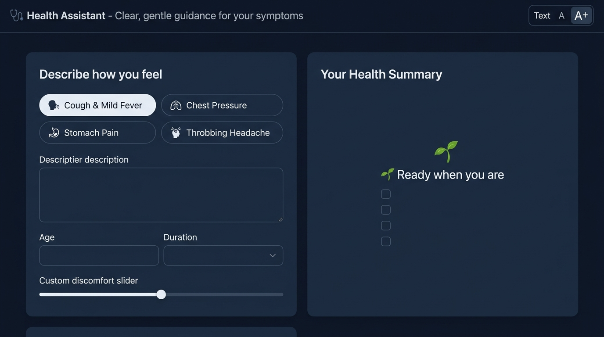
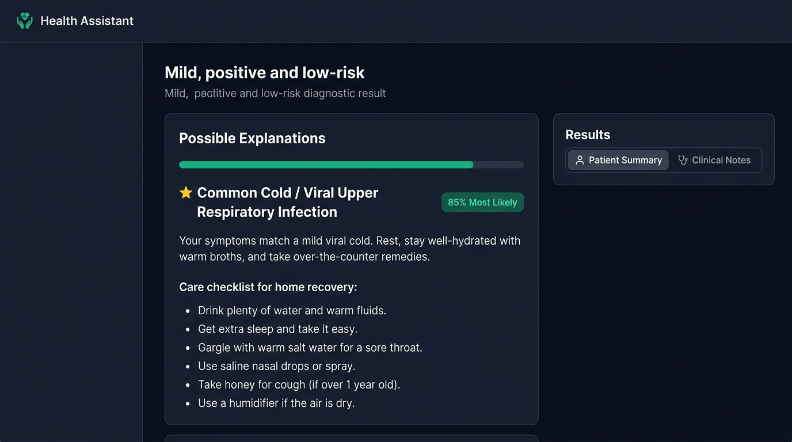
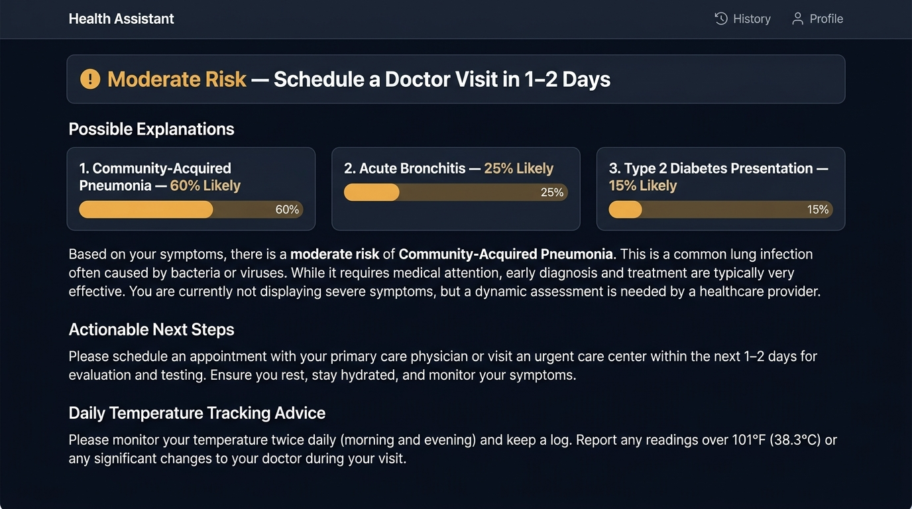
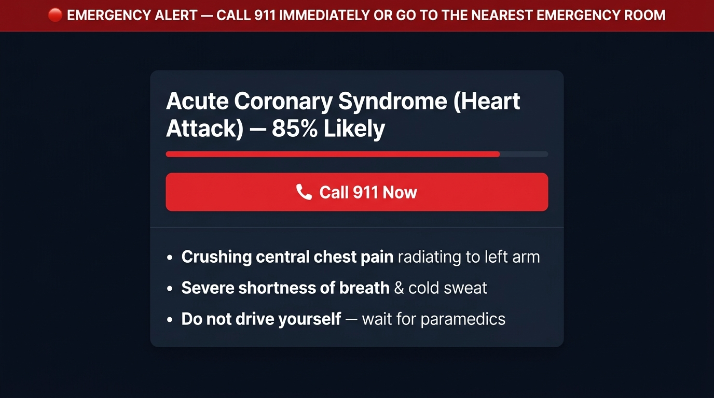

# 🩺 Health Assistant — AI Clinical Decision Support (CDS) System

[](https://python.org)
[](https://flask.palletsprojects.com/)
[](https://opensource.org/licenses/MIT)

A humane, senior-friendly **AI Clinical Decision Support (CDS)** and differential diagnosis system built with **Python + Flask**, designed with **radical minimalism** following the [Claude Design Principles](design.md). Features invisible backend **Retrieval-Augmented Generation (RAG)**, **Long-Context Grounding**, and real-time **Web Research**.

---

## 📸 Minimalist UI Showcase & Test Cases

### 1. 🌿 Minimalist Home & Input State
*Spacious, serene layout with quick symptom pills, intuitive discomfort slider, and accessible text sizing.*



---

### 2. 🟢 Positive Test Case (Mild / Low-Risk Result)
*Clear, reassuring explanation for common manageable ailments with practical home care checklists.*



---

### 3. 🟡 Neutral Test Case (Moderate-Risk / Doctor Follow-Up)
*Triple differential likelihood progress cards with clear diagnostic guidance and 48-hour consultation advice.*



---

### 4. 🔴 Negative / Critical Test Case (Emergency Red Flag Alert)
*High-contrast urgent alert banner with 1-click **"📞 Call 911 Now"** action and emergency safety instructions.*



---

## 🌟 Key Capabilities

1. **Radical Minimalism & Human-Centric Design:**
   - Designed strictly following [Claude Design System Principles](design.md) — zero developer clutter, zero technical badges, and no raw API forms exposed to patients.
   - Senior-accessible high-contrast dark theme, large 17px/21px typography, and 1-click quick symptom presets.
2. **Dual-Tier Output Architecture:**
   - 👤 **Patient Summary:** Urgency badge (🟢 Mild, 🟡 Moderate, 🔴 Emergency), everyday condition names, 6th-grade reading level explanation, and home care steps.
   - 🩺 **Clinical Notes:** Clean, discreet accordion with structured medical references and ICD-10 diagnostic coding.
3. **Invisible Background Intelligence:**
   - **RAG Mode:** Okapi BM25 semantic retrieval with medical synonym expansion over WHO, NIH, CDC, GLOBOCAN, and the NHS Inform Scotland directory (433 conditions).
   - **Real-Time Web Research:** Deep clinical literature verification executes silently under the hood.
4. **Self-Evolving Knowledge Loop:**
   - Automatically archives evaluated cases into persistent memory (`data/evolving_knowledge.json`) to continually refine future differential calibration.

---

## 📁 Repository Structure

```
.
├── symptom-rag-analyzer/          # Master Clinical Decision Support Application
│   ├── app.py                     # Flask Web Server & REST API
│   ├── rag_engine.py              # BM25 Semantic Indexer & Synonym Expansion Engine
│   ├── web_researcher.py          # Real-Time Clinical Literature Research Engine
│   ├── llm_client.py              # Multi-Provider Gateway (CliProxy, Gemini, OpenAI, OpenRouter)
│   ├── prompt.md                  # Master Clinical Knowledge Base & CDS Directives
│   ├── requirements.txt           # Python Dependencies
│   ├── data/
│   │   ├── knowledge_base.json    # 46 Structured Clinical Profiles + Zenodo 13338116 Dataset
│   │   ├── evolving_knowledge.json# Self-Evolving Case Memory Archive
│   │   └── research_cache/        # Cached Markdown Web Research Reports
│   ├── templates/index.html       # Minimalist Single-Page Application UI
│   └── static/                    # Serene CSS Styles & Client Controller
├── docs/screenshots/              # High-Resolution Minimalist UI Mockups & Test Cases
├── design.md                      # Claude Minimalist Design System Architecture Guide
├── index.js                       # Cloudflare Worker Backblaze B2 File Manager Router
├── wrangler.toml                  # Cloudflare Worker Deployment Configuration
└── README.md                      # Project Documentation
```

---

## 🚀 Quick Start

### 1. Installation
```bash
cd symptom-rag-analyzer
pip install -r requirements.txt
```

### 2. Configure Environment Variables (Optional)
```bash
# Optional LLM Provider Overrides
export CLIPROXY_API_KEY="aravind616"
export GEMINI_API_KEY="your-gemini-key"
export OPENAI_API_KEY="your-openai-key"
```

### 3. Start Application Server
```bash
python app.py
```
Open **`http://localhost:5000`** in your browser.

---

## 🔌 API Reference

### `POST /api/analyze`
Executes symptom differential analysis with RAG retrieval and dual-layer output.

### `GET /api/health` & `GET /api/stats`
Returns system health, document counts, and engine status.

---

## ⚖️ Regulatory Compliance Notice
This system operates strictly under **FDA Clinical Decision Support (CDS) Guidance** and **WHO AI Health Ethics Principles**. It is intended as an informational clinical support tool and does not issue binding medical diagnoses or replace an in-person evaluation by a licensed physician.

---

## 📄 License
MIT License.