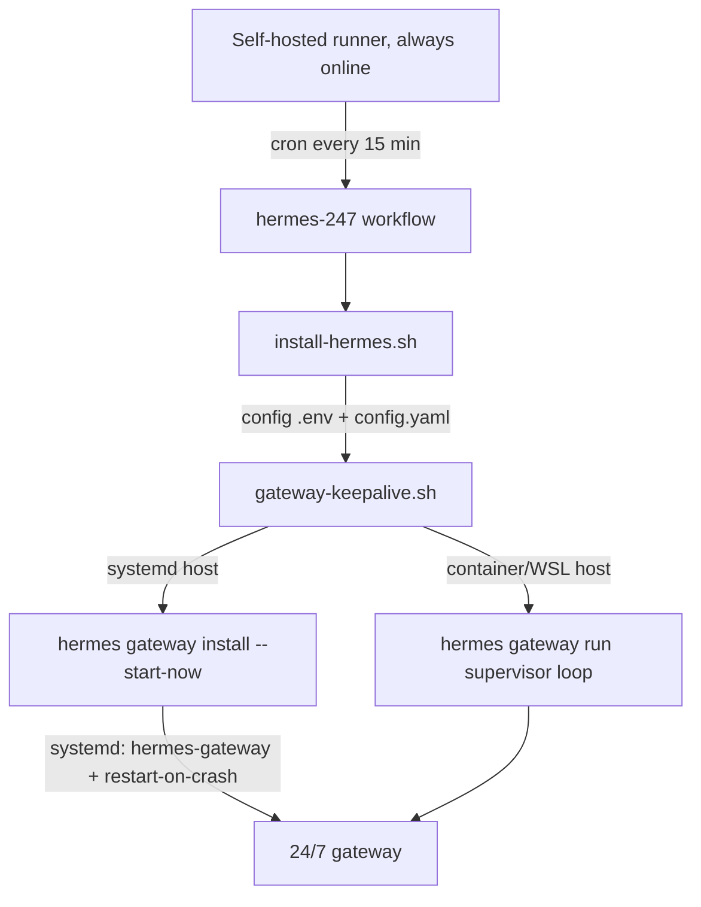

# Hermes Agent — 24/7 GitHub Actions Automation

Runs the [Nous Research Hermes Agent](https://hermes-agent.nousresearch.com/) continuously on a
**self-hosted GitHub Actions runner** with zero manual interaction after the first deploy.

- Installs Hermes automatically (idempotent).
- Configures native **Google Gemini** (`gemini-3.6-flash` / `gemini-2.5-pro`) from GitHub secrets.
- Registers a **Telegram bot** for the messaging gateway.
- Keeps the gateway alive **24/7** and auto-heals it on crash.

---

## Folder Contents

| File | Purpose |
|------|---------|
| `.github/workflows/hermes-247.yml` | The 24/7 GitHub Actions workflow (job runs on `self-hosted`). |
| `hermes-agent/install-hermes.sh` | Idempotent installer + config bootstrap used by the workflow. |
| `hermes-agent/gateway-keepalive.sh` | Supervisor loop that ensures the gateway is always running. |

> GitHub Actions only picks up workflows from `.github/workflows/` at the repo root,
> so the workflow YAML lives there even though the helper scripts live in `hermes-agent/`.

---

## Architecture (how 24/7 works)

A single GitHub workflow is **not** permanently long-lived, so the durable design is:

1. **Self-hosted runner = the permanent host.** A runner machine that is left powered on
   and online is the machine that actually runs Hermes around the clock.
2. **Systemd service (Linux hosts).** When the runner host has systemd, `hermes gateway
   install --start-now` installs a unit named `hermes-gateway` that autostarts at boot
   and restarts on crash. This is what gives true 24/7 persistence, independent of any
   GitHub job. (Container/WSL/Termux runners skip this step — the docs say there the
   container runtime is your service manager.)
3. **Foreground supervisor (containers).** On runners without systemd, the docs
   recommend `hermes gateway run`; `gateway-keepalive.sh` runs it in a bounded
   auto-restart loop so the gateway stays alive for the duration of the job.
4. **Cron health-check.** The workflow fires on a schedule (default `*/15 * * * *`), and
   each run re-verifies the install and revives the gateway if it is down. This is the
   self-healing safety net.

### Recommended setup



---

## Prerequisites

- A **self-hosted GitHub runner** already registered to this repository's Settings → Actions → Runners.
- The runner's machine left powered on and online.
- A Telegram bot token from [@BotFather](https://t.me/BotFather).
- A Google AI Studio API key from [aistudio.google.com/apikey](https://aistudio.google.com/apikey).
- `sudo` or the runner service account having systemd permission if you use the systemd path.

---

## First-Time Setup (one-time, ~5 min)

### 1. Add repository secrets

Go to **Repo → Settings → Secrets and variables → Actions**, and add:

| Secret name | Value |
|-------------|-------|
| `GEMINI_API_KEY` (or `GOOGLE_API_KEY`) | Google AI Studio key (`AIzaSy...` or `AQ.Ab8...`) |
| `TELEGRAM_BOT_TOKEN`  | Telegram bot token (`123456:ABC...`) |
| `TELEGRAM_ALLOWED_USERS` | (optional, recommended) comma-separated Telegram user IDs allowed to DM the bot. If unset, defaults to `*` (anyone). |
| `TELEGRAM_HOME_CHANNEL` | (optional) default chat/group ID where scheduled-task results are delivered |
| `TELEGRAM_GUEST_MODE` | (optional) `true` lets non-allowlisted groups interact via explicit @mention only |
| `HERMES_DEFAULT_MODEL` | (optional) e.g. `gemini-3.6-flash` (default) or `gemini-2.5-pro` |

> Never paste secrets into YAML or scripts. The workflow reads them from GitHub secrets only.

### 2. Add labels to your runner

Go to **Settings → Actions → Runners → click your runner → Edit**, and add the label `hermes`.
(Or change the `runs-on` in the workflow to match your existing label.)

### 3. Push the workflow to `main`

```bash
git add .github/workflows/hermes-247.yml hermes-agent/
git commit -m "Add Hermes agent 24/7 automation"
git push origin main
```

GitHub will enable the workflow automatically.

---

## How to use the 24/7 agent

### Chat remotely via Telegram
Once the gateway is up with your token, message your bot directly on Telegram.
- Send `/set_home` in your direct message or target channel to register it as the agent's primary home channel.
- Hermes will respond and persist the session context across messages so it "grows with you" over time.

### One-shot CLI check
The workflow's **second job** (`self-test`) runs a non-interactive message to confirm the
LLM provider works end-to-end:

```bash
hermes chat --quiet -q "Reply with exactly: HERMES_ONLINE"
```

You can also run this locally after install to verify before deploying.

---

## Security Notes

- Installer lives under `~/.hermes/` (or `$HERMES_HOME`).
- API keys live in `~/.hermes/.env`, **never** in the repo.
- The workflow redacts secrets from logs; avoid printing them in `run:` blocks.
- Restrict the runner to this repo if it is shared hardware.

---

## Troubleshooting

| Symptom | Fix |
|---------|-----|
| Job says "no eligible runners" | Runner offline/label mismatch. Recheck label + network. |
| `hermes: command not found` | Runner service PATH lacks `~/.local/bin`. Symlink `venv/bin/hermes` into `/usr/local/bin`. |
| Gateway starts then stops | Check `~/.hermes/data/logs/gateway.log`. Ensure `sudo loginctl enable-linger <runneruser>` for boot autostart. |
| Chat works but Telegram silent | Wrong `TELEGRAM_BOT_TOKEN`, or the bot isn't started (`hermes gateway status`). |