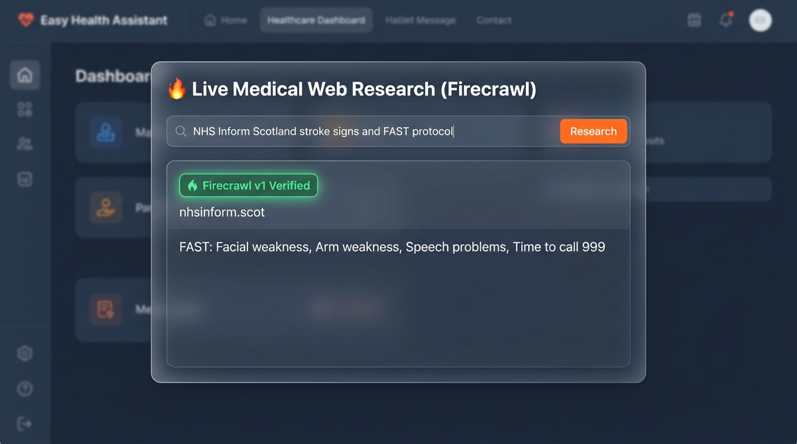

# 🩺 AI Clinical Decision Support (CDS) & Symptom RAG Analyzer

A full-stack medical **Clinical Decision Support (CDS)** and differential diagnosis application built with **Python + Flask**, featuring **Retrieval-Augmented Generation (RAG)**, **Long-Context Grounding**, real-time **Firecrawl v1 Web Research**, and a **Senior-Friendly Accessible UI**.

---

## 📸 UI Screenshots & Test Cases

### 1. 🟢 Positive (Mild / Low-Risk Result)


### 2. 🟡 Neutral (Moderate-Risk / Doctor Follow-Up)


### 3. 🔴 Negative / Critical (Emergency Red Flag Alert)


### 4. 🔥 Live Firecrawl Medical Web Research Modal


---

## 🌟 Core Features

1. **Dual-Tier Output Architecture:**
   - 👤 **Section A (Plain-Language Patient Summary):** Urgency level (🟢 Mild, 🟡 Moderate, 🔴 Emergency), everyday condition names, 6th-grade reading level explanation, home care checklist, and 911 warning signs.
   - 🩺 **Section B (Detailed Clinician Reference):** Percentage differential probability table, ICD-10 diagnostic coding, pathophysiological concordance, and recommended diagnostic lab/imaging workups.
2. **Firecrawl v1 Deep Web Research:**
   - Scans reasoning streams for `[WEB_SEARCH: <url_or_topic>]` and `[FIRECRAWL_SEARCH: <query>]`.
   - Fetches and scrapes authoritative clinical literature in high-fidelity Markdown, injecting live findings back into the diagnosis loop.
3. **Dual Context Architectures (RAG vs Long-Context):**
   - **RAG Mode:** Okapi BM25 semantic retrieval with medical synonym expansion over WHO, NIH, CDC, GLOBOCAN, and the NHS Inform Scotland directory (433 conditions).
   - **Long-Context Mode:** Ingests the full medical repository into large context windows (1M+ tokens).
4. **Self-Evolving Knowledge Loop:**
   - Automatically archives evaluated cases into persistent memory (`data/evolving_knowledge.json`) to continually refine future differential calibration.
5. **Senior Accessibility:**
   - High-contrast dark theme, large 17px/20px typography, 1-click `A / A+` font resizer, and 1-click common symptom presets.

---

## 🚀 Getting Started

### 1. Install Dependencies
```bash
pip install -r requirements.txt
```

### 2. Configure Environment Variables (Optional)
```bash
# Firecrawl Web Research Key
export FIRECRAWL_API_KEY="fc-bfc1c5abb4aa4f69b0da8f12c5b444d6"

# Optional LLM Provider Overrides
export CLIPROXY_API_KEY="aravind616"
export GEMINI_API_KEY="your-gemini-key"
export OPENAI_API_KEY="your-openai-key"
```

### 3. Run the Flask Web Application
```bash
python app.py
```
Open **`http://localhost:5000`** in your browser.

---

## 🔌 API Endpoints

### `POST /api/analyze`
Submits symptoms for differential ranking and dual-tier CDS output.

### `POST /api/research`
Directly conducts live web search or scrapes a medical URL with Firecrawl.

### `GET /api/documents`
Returns all indexed clinical guidelines and evolving cases.

### `GET /api/history`
Returns historical cases stored in the self-evolving knowledge loop.

### `GET /api/health` & `GET /api/stats`
Returns system health, document counts, and Firecrawl engine status.

---

## ⚖️ Regulatory Compliance Notice
This system operates strictly under **FDA Clinical Decision Support (CDS) Guidance** and **WHO AI Health Ethics Principles**. It is intended as an informational clinical support tool and does not issue binding medical diagnoses or replace an in-person evaluation by a licensed physician.

---

## 📄 License
MIT License.
